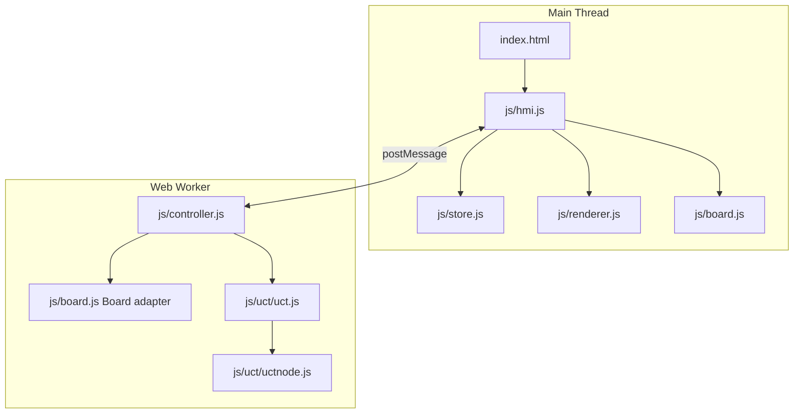

# Software Architecture - Connect 4

> Copyright (c) 2016, 2026 Oliver Merkel. MIT License.

## 1. Overview

This project is a browser-only single-page application implementing Connect 4 with optional AI players.
It uses modern ES modules, a Web Worker for game/AI control, and no runtime framework.

Core characteristics:

- ES module architecture with a single entry point.
- Pure board state transitions for deterministic testing.
- Worker-owned authoritative game state.
- MCTS/UCT AI engine reused across rule implementations.
- SVG renderer in the main thread.
- Vitest unit tests and Playwright E2E tests.

For detailed UCT/MCTS internals and budget tuning, see [engine_mcts_ucb.md](engine_mcts_ucb.md).

## 2. High-Level Architecture



## 3. Runtime Data Flow

1. UI sends `start`, `restart`, `move`, `action_by_ai`, or `sync` requests to the worker.
2. Worker updates board state and posts `redraw`, `human_to_move`, or `ai_to_move` messages.
3. HMI maps worker messages to store actions.
4. Store updates state and triggers renderer updates.

Main move loop:

- Human picks a selectable column.
- Worker validates and applies `doAction`.
- If game is terminal, worker stops handoff.
- Otherwise worker posts `human_to_move` or `ai_to_move`.

UI status loop:

- Store updates trigger board re-render in `renderer.render(boardState, selectableColumns)`.
- Header title changes by active view (or to `AI thinking...` during AI turns).
- Header badge reflects side-specific strengths and profile (for example `AI: R Easy | Y Hard | Desktop`).

## 4. Module Responsibilities

### `js/common.js`

Shared constants:

- `COLUMNS = 7`, `ROWS = 6`
- `EMPTY = 0`, `SOUTH = 1`, `NORTH = 2`
- `PLAYERS = { HUMAN, AI }`

UI terminology uses Red and Yellow for the two players. Internal state and settings
still refer to those same two sides as South and North.

### `js/board.js`

Pure Connect 4 state logic plus mutable adapter class for UCT.

State shape:

```js
{
  active: 0 | 1,
  grid: number[6][7],
  winner: 0 | 1 | null,
  isDraw: boolean,
  latestMove: { row, column, player } | null,
  winningLine: { row, column }[] | null
}
```

Key exports:

- `createBoard()`
- `getActions(board)` -> legal columns
- `doAction(board, column)` -> drop piece, evaluate terminal state
- `getResult(board)` -> reward vector for UCT
- `Board` mutable adapter (`getActions`, `doAction`, `copy`, `getResult`, `active`)

### `js/renderer.js`

SVG board renderer for a 7x6 grid.

- `createRenderer(container, onColumnClick)`
- `render(boardState, selectableColumns)`
- Highlights the latest move and winning line.
- Shows terminal overlays:
  - win: fireworks + `Win!` text
  - draw: `Draw` text (no fireworks)
- `flashSowing(column)` kept as a generic visual hook

### `js/store.js`

Reactive state container and reducer.

Main UI state fields:

- `view`
- `board`
- `selectableColumns`
- `phase`
- `settings: { playerSouth, playerNorth, difficultySouth, difficultyNorth, deviceProfile, resolvedDeviceProfile }`

Actions:

- `NAVIGATE`
- `ENGINE_BOARD_UPDATE`
- `HUMAN_TURN_READY`
- `AI_THINKING`
- `SETTINGS_CHANGE`
- `NEW_GAME`

### `js/controller.js`

Worker-side orchestration.

- Owns board state (`Board` instance).
- Applies settings from UI, including independent Red/Yellow difficulty and resolved device profile.
- Uses profile-specific MCTS budget tables (Desktop/Mobile).
- Chooses the budget by active side each AI turn:
  - player 0 (Red/South) uses `difficultySouth`
  - player 1 (Yellow/North) uses `difficultyNorth`
- Delegates AI move selection to `Uct.getActionInfo(...)`.

Algorithm details, UCB equation, and parameter interaction are documented in
[engine_mcts_ucb.md](engine_mcts_ucb.md).

### `js/hmi.js`

Main-thread composition module.

- Creates store, renderer, and worker.
- Wires menu/navigation/options events.
- Reads options and sends settings to worker.
- Dispatches worker events into store.
- Maintains header side-specific difficulty badge from store settings.
- Registers the service worker (`sw.js`) after window load.

### `sw.js`

Service worker for PWA install/offline support.

- Uses a versioned cache (`connect4-v2`).
- Pre-caches a strict app shell at install time.
- Reads `manifest.json` and additionally caches icon/screenshot assets listed there.
- Uses network-first for navigation requests and cache-first for same-origin static assets.
- Falls back to cached app shell (`index.html`) when offline navigation cannot hit network.

### Worker events and store actions

Worker messages consumed in HMI:

- `redraw` -> `ENGINE_BOARD_UPDATE`
- `human_to_move` -> `HUMAN_TURN_READY`
- `ai_to_move` -> `AI_THINKING` then request `action_by_ai`

Reducer actions in `js/store.js`:

- `NAVIGATE`
- `ENGINE_BOARD_UPDATE`
- `HUMAN_TURN_READY`
- `AI_THINKING`
- `SETTINGS_CHANGE`
- `NEW_GAME`

## 5. Threading Model

- Main thread: rendering, UI events, navigation state.
- Worker thread: rules, turn progression, AI compute.

Worker is the single writer for board state.
Main thread consumes snapshots broadcast by worker.

## 6. PWA and Offline Model

- Service worker registration lives in `js/hmi.js` and installs `sw.js`.
- Install flow:
  - Cache required shell assets (`index.html`, CSS, JS, manifest, core icons).
  - Attempt manifest-driven icon/screenshot caching as an additive pass.
- Activate flow:
  - Delete outdated cache versions.
  - Claim clients so updates apply quickly.
- Fetch flow:
  - Navigation: network-first with cached fallback.
  - Same-origin assets: cache-first with runtime cache population.

## 7. Testing

- Unit tests: `tests/unit/*.test.js`
  - Board rule behavior
  - UCT behavior and adapter integration
- E2E tests: `tests/e2e/game.spec.js`
  - Navigation and options
  - Difficulty badge updates
  - Interactive move flow
  - Accessibility smoke checks

## 8. Folder Structure

```text
src/
├── index.html
├── css/index.css
├── doc/software_architecture.md
├── js/
│   ├── common.js
│   ├── board.js
│   ├── controller.js
│   ├── hmi.js
│   ├── renderer.js
│   ├── store.js
│   └── uct/
│       ├── uct.js
│       └── uctnode.js
└── tests/
    ├── e2e/game.spec.js
    └── unit/*.test.js
```
