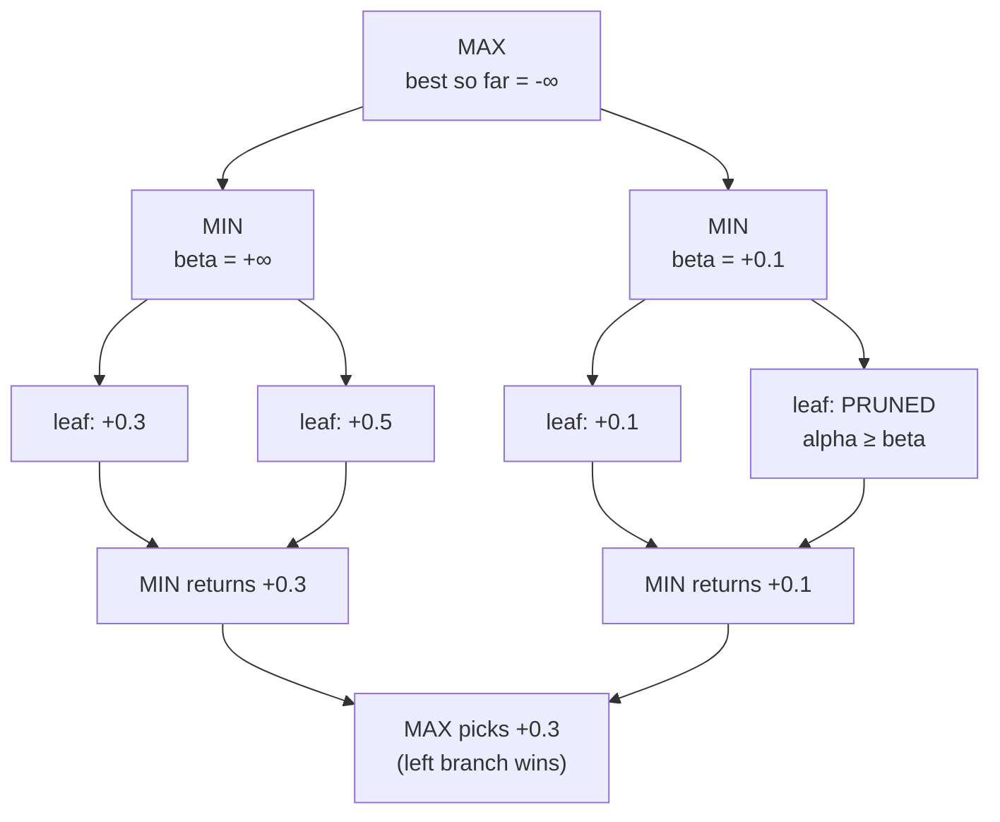

# Alpha-Beta engine

`alphabeta_suggestion()` uses the same basic decision model as minimax, but adds
alpha-beta pruning.

## Why it exists

Plain minimax evaluates every reachable node within the depth limit. Alpha-beta
reduces work by cutting off branches that cannot change the final decision.

## Search behavior

- Player 1 maximizes
- Player 2 minimizes
- `alpha` tracks the best guaranteed score for the maximizing player
- `beta` tracks the best guaranteed score for the minimizing player
- when `alpha >= beta`, the remaining branch is pruned

## Practical effect

For the same depth limit, alpha-beta can often evaluate fewer nodes than plain
minimax while returning the same best move and score.

The diagram below shows a small two-level tree where pruning eliminates one
branch entirely. Once MAX has established a guaranteed score of `+0.5` via the
left branch, it inspects the right MIN node and finds `+0.1` as the first child.
Because `+0.1` is already below the guaranteed `+0.5`, no further children of
that MIN node can affect the MAX decision — they are pruned.

## Validation

- `depth` must be at least `1`
- if there are no legal moves, the function raises `ValueError`

## Default depth

The current default depth is higher than for minimax, reflecting that pruning
can make deeper search practical for the same game.

## Further improvements: move ordering

Alpha-beta pruning effectiveness is highly sensitive to move ordering. The
current implementation explores moves in their natural order (left to right
column). Sorting moves before exploration—for example, center-first or by
static evaluation—can significantly reduce the number of nodes visited and thus
increment practical search depth for the same response time.

Future optimization targets could include:

- prioritizing center columns (which tend to yield stronger positions)
- sorting child moves by a quick heuristic before recursing
- using refutation tables or history heuristics for move ordering hints
