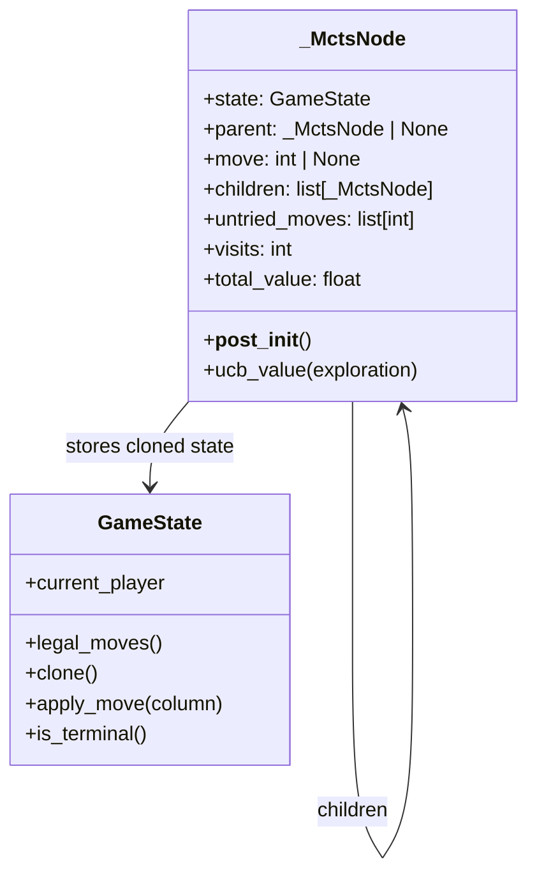
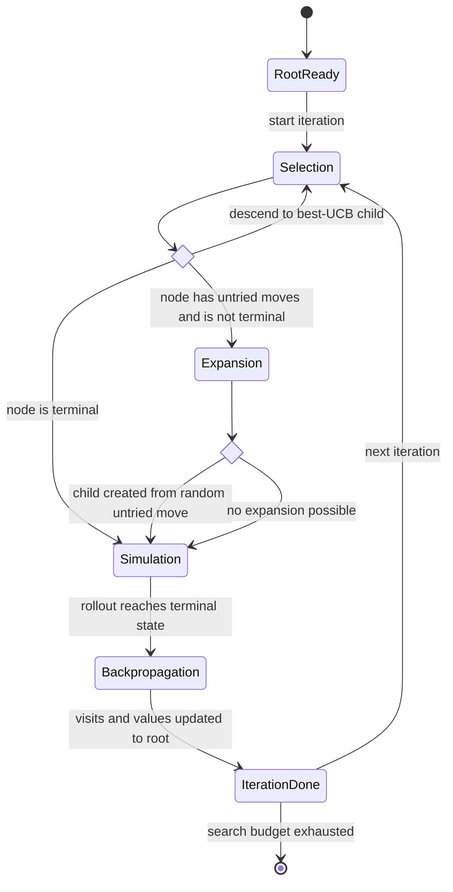

# Monte Carlo Tree Search (MCTS)

`mcts_suggestion()` implements a lightweight MCTS engine.

It uses a private `_MctsNode` structure storing:

- the current `GameState`
- the parent node
- the move that led to the node
- child nodes
- untried legal moves
- visit count
- accumulated rollout value

## Internal node structure

## The four MCTS phases

### 1. Selection

Starting from the root, the engine repeatedly selects the child with the highest
UCB score until it reaches a node that is terminal or still has untried moves.

The implementation uses infinite UCB for unvisited nodes to ensure exploration.

### 2. Expansion

If the selected node still has untried legal moves and is not terminal, one move
is chosen at random, applied to a cloned state and inserted as a new child.

### 3. Simulation

From the expanded node, `_random_rollout()` plays random legal moves until a
terminal state is reached.

The rollout result is scored with `terminal_score()`.

### 4. Backpropagation

The rollout score is propagated from the expanded node back to the root by
incrementing visit counts and adding the score to `total_value`.

## UCB handling

The node method `ucb_value(exploration)` combines:

- the empirical mean node value
- an exploration bonus based on parent visits and node visits

The implementation also flips the mean when appropriate so child selection stays
consistent with alternating turns.

## Exploration vs exploitation in UCB

This is the central tradeoff in MCTS selection.

- **Exploitation** means preferring children that already look strong based on
  observed rollout results.
- **Exploration** means continuing to try children with less evidence so the
  search does not get trapped too early in a misleading local favorite.

UCB balances those two pressures in one score.

In this implementation, the score for a visited node is:

$$
\operatorname{UCB}(n) = \operatorname{mean}(n) + c \sqrt{\frac{\ln N}{n}}
$$

where:

- $\operatorname{mean}(n)$ is the node's average accumulated rollout value
- $c$ is the exploration constant passed as `exploration`
- $N$ is the parent visit count
- $n$ is the node visit count

The actual code behavior is slightly specialized for this project:

$$
\operatorname{mean}(n) = \frac{\operatorname{total\_value}(n)}{\operatorname{visits}(n)}
$$

and then, when the parent state is Player 2 to move, that mean is negated
before the exploration bonus is added. This matters because rollout scores are
stored in the shared Player-1-centered convention, but child selection still
needs to remain coherent when turns alternate.

Unvisited nodes are treated as having infinite UCB, which guarantees they are
selected before heavily re-sampling already visited siblings.

## What the two terms do

The two parts of the formula have different jobs.

1. Exploitation term: $\operatorname{mean}(n)$

   This favors children whose past rollouts already produced better outcomes.
   If a move repeatedly leads to wins or good average results, its empirical
   mean rises and selection is biased toward it.

2. Exploration term: $c \sqrt{\frac{\ln N}{n}}$

   This favors children with fewer visits. The bonus gets smaller as a node is
   sampled more often, and larger as the parent accumulates more total visits.
   So rarely visited children keep receiving periodic attention even when their
   current empirical mean is not the highest.

Intuitively:

- many visits to a child -> more trust in its average -> smaller exploration bonus
- few visits to a child -> more uncertainty -> larger exploration bonus
- more visits to the parent overall -> more pressure to revisit underexplored children

## Influence of the exploration constant

The exploration constant $c$ controls how aggressively MCTS investigates less
visited children.

- smaller $c$ -> more exploitation
- larger $c$ -> more exploration

In this project, the default is:

$$
  c = \sqrt{2}
$$

That is a common generic default for UCT-style search and is a reasonable
starting point when no game-specific tuning has been done.

Practical effects:

- if $c$ is too small, the search can become overconfident too early and keep
  revisiting one apparently good child while missing stronger alternatives
- if $c$ is too large, the search spreads effort too broadly and may fail to
  refine the best candidates enough within the available iteration budget

## How to choose the exploration constant

There is no universally optimal value. It should be chosen empirically for the
combination of:

- game structure
- rollout noise
- evaluation range
- search budget
- desired playing style

Useful tuning guidance:

- start with $\sqrt{2}$ as a baseline
- decrease it if you want more greedy, stability-seeking behavior under a small
  iteration budget
- increase it if rollouts are noisy and the engine seems to commit too early to
  weak lines
- benchmark candidate values using repeated self-play or fixed test positions,
  not just one or two anecdotal games

In this codebase, tuning `exploration` is especially relevant because MCTS does
not rely heavily on a rich static evaluator. Much of its decision quality comes
from how effectively selection allocates rollout effort across the tree.

## Output behavior

MCTS currently returns:

- the best child move at the root
- a PV containing that one move only
- an evaluation equal to the child's average rollout value

MCTS is stochastic by design. To obtain reproducible behavior in tests,
provide a seeded `random.Random` instance.

This differs from minimax and alpha-beta, which can return deeper PV sequences.

## Validation

- `iterations` must be at least `1`
- if there are no legal moves, the function raises `ValueError`

## Fallback path

If the root somehow ends with no children after the search loop, the engine falls
back to the first legal move and evaluates the resulting position directly.
