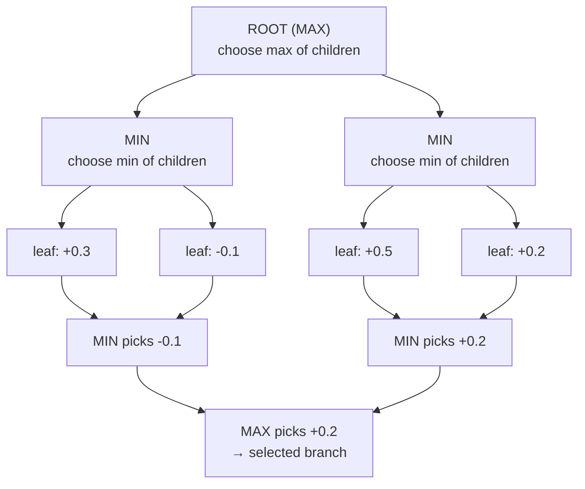

# Minimax engine

`minimax_suggestion()` performs a depth-limited recursive minimax search.

## Search behavior

- recursion stops when the depth reaches `0`
- recursion also stops on terminal states
- every legal move is explored at each level
- Player 1 is treated as the maximizing side
- Player 2 is treated as the minimizing side

The helper `_best_for_player()` selects the best candidate depending on whose
turn it is in the current state.

Example tree at depth 2 (values are `evaluate_state()` scores at leaves,
propagated upward by minimax):

## Principal variation

The minimax implementation builds a PV by prepending the current move to the
best child PV returned by recursion.

As a result:

- `pv[0]` is always the engine's selected move
- later elements show the continuation that produced the best score

## Validation

- `depth` must be at least `1`
- if there are no legal moves, the function raises `ValueError`

## Typical use

Use minimax when you want a fully deterministic search-based suggestion and the
position is small enough for exhaustive depth-limited exploration.
