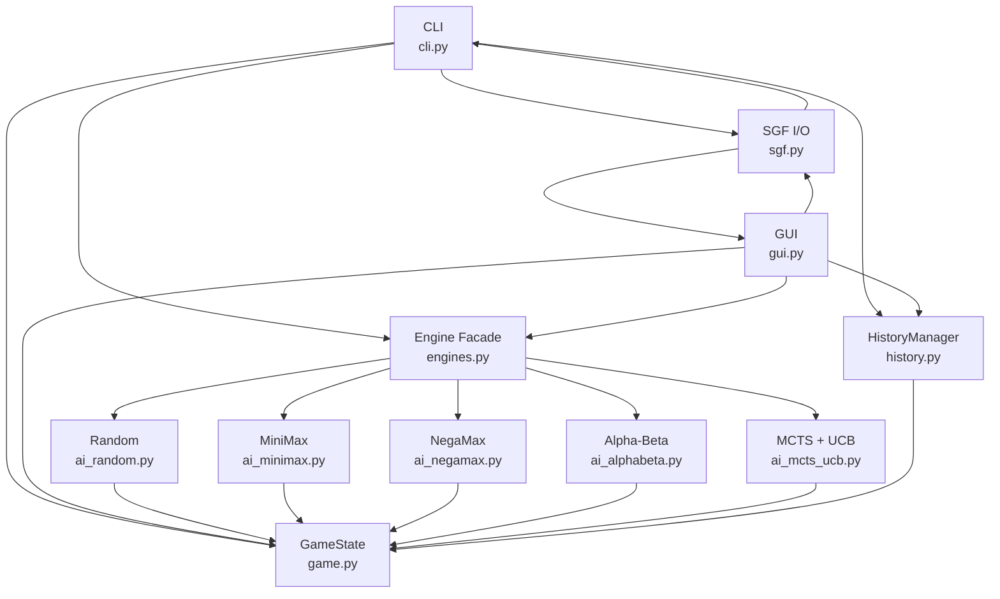
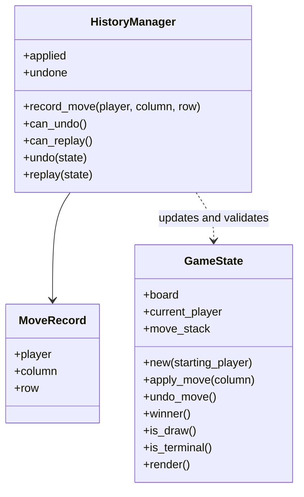
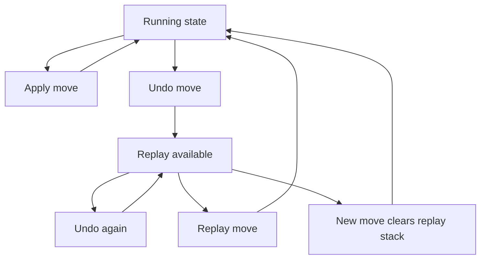
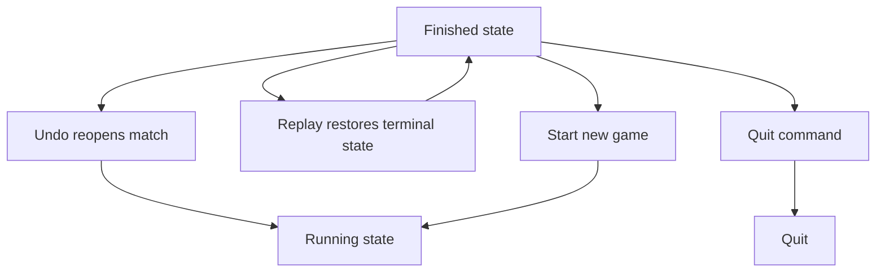
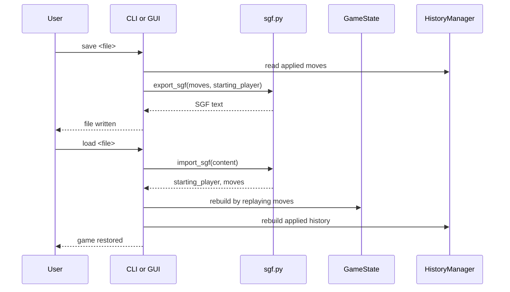
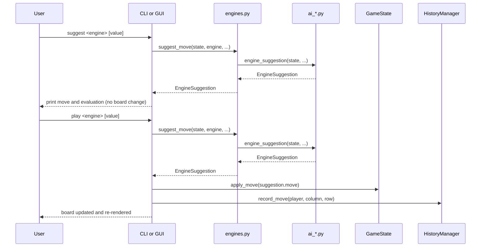
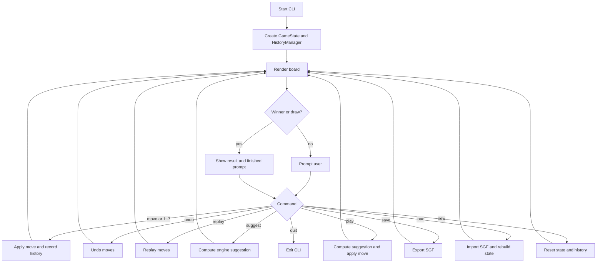

# Software Architecture - Four in a Row

This document describes the implemented architecture and intended usage.
Use Zensical to render this markdown documentation.

## Goals

- Complete, runnable Python implementation.
- Deterministic game rules for 7x6 Four in a Row.
- Human-vs-human gameplay with AI engines.
- Persist and restore games using SGF.
- Unit tests with high coverage focus.

## Module Overview

## Architectural Principle: Shared Core, Thin Front-Ends

The project follows a shared-core architecture:

- Core domain and rules live in `game.py` and `history.py`.
- Search behavior lives behind `engines.py` and the `ai_*` modules.
- Persistence lives in `sgf.py`.
- `cli.py` and `gui.py` are front-ends that orchestrate I/O and presentation.

This keeps game behavior consistent across terminal and GUI modes and avoids
duplicating rule logic in multiple entrypoints.

Practical change-placement rule:

- If a change affects game legality, winner detection, undo/replay, SGF
    validity, or engine decision logic, implement it in the shared core modules.
- If a change affects command wording, prompts, click handling, rendering, or
    frontend-specific UX, implement it in the respective front-end (`cli.py` or
    `gui.py`).

### Where to change what

Quick reference for contributors:

| Change type | File(s) to edit |
| --- | --- |
| Game rules or move legality | `game.py` |
| Winner / draw detection | `game.py` |
| Undo / replay semantics | `history.py`, then `cli.py` and/or `gui.py` |
| CLI prompt text or command wording | `cli.py` |
| Board rendering in terminal | `cli.py` |
| Board rendering in GUI | `gui.py` |
| Static board evaluation heuristic | `game.py` → `evaluate_state()` |
| New engine algorithm | new `ai_*.py` module + register in `engines.py` |
| SGF format or field names | `sgf.py` |
| Engine dispatch or public API | `engines.py` |
| Tests for game rules | `tests/test_game.py` |
| Tests for CLI commands | `tests/test_cli.py` |
| Tests for engine behavior | `tests/test_engine_*.py` |

## Core Domain Model

### `GameState` (`four_in_a_row/game.py`)

Responsibilities:

- Owns the board, move stack and current player.
- Validates moves and applies gravity.
- Supports undo of the most recent move.
- Detects winner/draw/terminal conditions.
- Renders board as terminal-friendly text.

Board representation:

- `board[row][column]`, where row 0 is the bottom row.
- Width = 7, height = 6.

Core model snapshot:

### `HistoryManager` (`four_in_a_row/history.py`)

Responsibilities:

- Records applied moves with player/column/row metadata.
- Supports `undo` and `replay` stacks.
- Verifies replay consistency against game state.

Undo/replay state transitions during active play:

Finished-state recovery transitions:

## SGF - The Smart Game Format

SGF is used as a GameState storage format here. Details are described in
[sgf.md](sgf.md), including replay-based legality validation during import.
For how SGF integrates into runtime behavior across front-ends, also see the
CLI and GUI flow sections below.

Persistence flow:

## Computer AIs - The Engines

Description of the available Computer Players, the Artificial Intelligence and
algorithms behind the scenes is in [engines.md](engines.md).

Implementation structure:

- `four_in_a_row/engines.py` provides the stable public API and dispatch.
- `four_in_a_row/ai_random.py` implements random move selection.
- `four_in_a_row/ai_minimax.py` implements depth-limited minimax.
- `four_in_a_row/ai_negamax.py` implements depth-limited negamax.
- `four_in_a_row/ai_alphabeta.py` implements alpha-beta search.
- `four_in_a_row/ai_mcts_ucb.py` implements MCTS with UCB-based selection.

### Suggest vs play flow

Both the CLI and GUI reach engine suggestions through `suggest_move()`. How the
result is used differs between `suggest` and `play`:

The engine itself is always read-only with respect to `GameState`. All cloning
and mutation for search purposes happens internally in the `ai_*` modules.

## GUI Usage and Flow

Implemented in `four_in_a_row/gui.py` and started primarily via
`python -m four_in_a_row.gui`.

The GUI is a matplotlib-driven front-end over the same domain model and engine
facade used by the CLI.

Runtime flow:

1. Resolve player configuration for both sides (human or engine).
2. Create board figure and status area.
3. Render current game state from `GameState`.
4. Process either:
    - human click input (column selection), or
    - AI turn execution through `suggest_move()`.
5. Record applied moves through `HistoryManager`.
6. On terminal game state, display result and run post-game prompt
    (`help`, `save`, `new`, `quit`).

### GUI-to-code map

- GUI orchestration class: `FourInARowGui` in `four_in_a_row/gui.py`.
- Board rendering/status updates: `_create_plot()` and `_render_board()`.
- Winning-line detection/highlight: `_winning_cells()`.
- Human interaction: `_on_click()`.
- AI turn loop: `_play_ai_turn()` and `_handle_ai_until_human_turn()`.
- Post-game command loop and SGF export: `_handle_post_game_prompt_if_needed()`.

## CLI vs GUI Capability Matrix

This quick matrix helps contributors decide whether a behavior is shared-core
logic or frontend-specific behavior.

| Capability | CLI (`cli.py`) | GUI (`gui.py`) | Shared core module(s) |
| --- | --- | --- | --- |
| Start app | `python -m four_in_a_row` | `python -m four_in_a_row.gui` | n/a |
| Human move input | text commands (`1..7`, `move`) | mouse click on column | `game.py`, `history.py` |
| Single-step AI advice | `suggest <engine> [value]` | internal AI helper calls | `engines.py`, `ai_*.py` |
| Single-step AI play | `play <engine> [value]` | internal AI helper calls | `engines.py`, `ai_*.py` |
| Continuous engine-vs-engine progression | not provided in CLI loop | supported (autoplay loop) | `gui.py` orchestration + `engines.py` |
| Undo/replay during running match | explicit commands (`undo`, `replay`) | not exposed as click command | `history.py` |
| Save/load from command loop | `save`, `load` during active loop | post-game `save` command | `sgf.py` |
| Post-game control surface | text prompt (`new`, `quit`, etc.) | text prompt after GUI match (`help`, `save`, `new`, `quit`) | frontend-specific |
| Board rendering | terminal text board | matplotlib board and status text | frontend-specific |
| Win-line visual highlight | no | yes | `gui.py` |

## CLI Usage and Flow

Implemented in `four_in_a_row/cli.py` and started primarily via
`python -m four_in_a_row` through `four_in_a_row/__main__.py`.
`main.py` remains as a compatibility wrapper.

Runtime flow:

1. Start new game and print help.
2. Loop:

    - display board,
    - check terminal condition,
    - read command,
    - execute move/undo/replay/suggest/save/load.

By default both players are human-controlled. The CLI can also delegate a
single move to an engine through `play <engine>`, while `suggest <engine>`
remains the non-mutating AI suggestion path.

Prompt behavior:

- The running CLI prompt includes a compact move counter.
- `#n` means `n` moves are currently applied.
- `#current/total` is shown when replay is possible, so contributors can see
    both the active move count and the full recorded move count.
- `undo` and `replay` remain available after a terminal game state in the CLI.
    An `undo` from a finished game returns the match to a running state.

CLI command flow:

### Command-to-code map

The CLI command handling lives in `run_cli()` in `four_in_a_row/cli.py`.

- Move commands (`1..7`, `move`) call `GameState.apply_move()` and then
    `HistoryManager.record_move()`.
- Suggestion commands (`suggest`, `play`) call `suggest_move()` from
    `four_in_a_row/engines.py`.
- Suggestion output formatting uses `_print_suggestion()` in
    `four_in_a_row/cli.py`.
- CLI suggestion output converts internal 0-based engine columns into human
    facing columns `1..7`.
- Persistence commands (`save`, `load`) call `export_sgf()` and `import_sgf()`.
- Undo/replay commands call `HistoryManager.undo()` and `HistoryManager.replay()`.

## Testing Strategy

Tests are in `tests/` and cover:

- game rules and winner detection,
- history undo/replay behavior,
- SGF roundtrip and validation,
- engine suggestion contract,
- CLI interaction and command handling,
- GUI rendering and interaction branches,
- GUI post-game command handling and entrypoints.

GUI tests are organized semantically in `tests/gui/`:

- `test_gui_config.py`
- `test_gui_rendering.py`
- `test_gui_ai_flow.py`
- `test_gui_click_interaction.py`
- `test_gui_post_game_prompt.py`
- `test_gui_entrypoints.py`

`pytest-cov` is configured in `pyproject.toml`.
